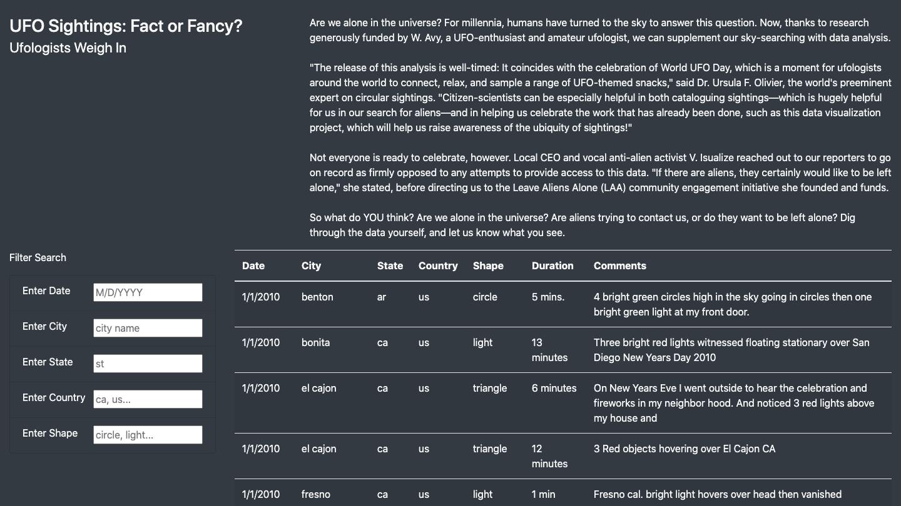
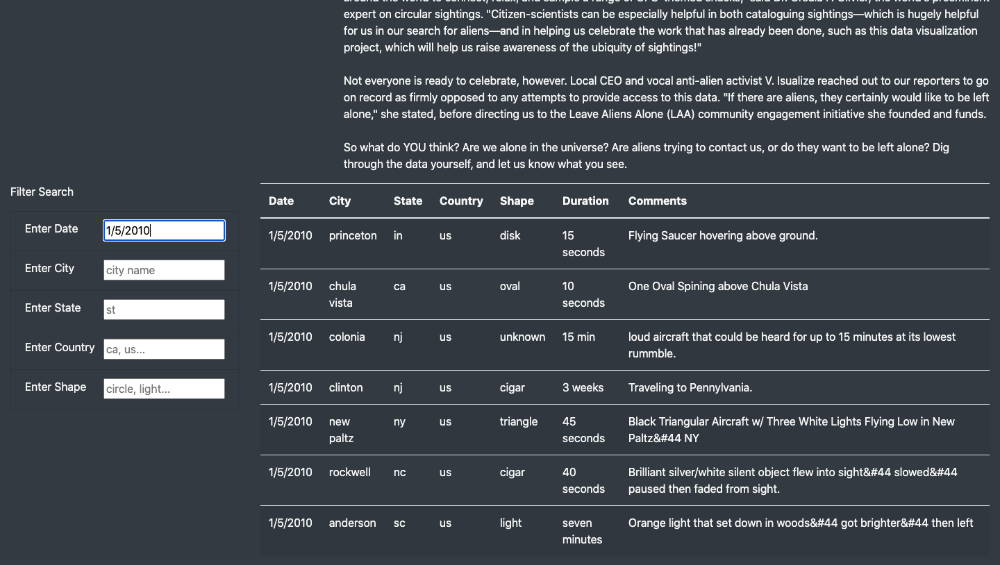
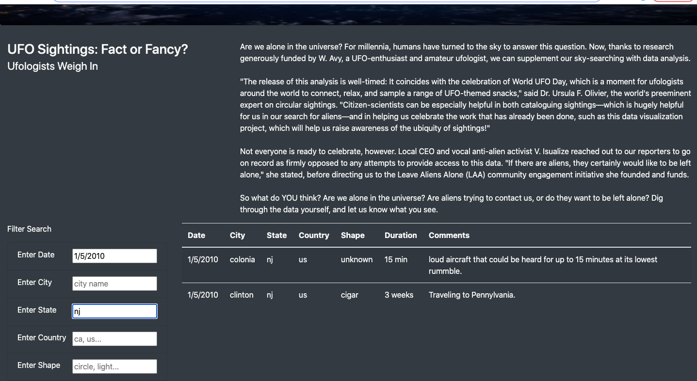

# ufo-sightings
Tools: Javascript, HTML, abd Bootstrap

## Overview
In this project we built an interactive webpage, which allowed the user to filter UFO sightings data based on a number of inputs like data, city, state, country, and shape of UFO. 

## Results
The result is an easy to navigate website where the user can quickly learn more about UFO sightings. It is desgined such that you do not have to refresh the page or click a button to filter the data. By simply entering the criteria in the field and pressing enter, the filtered data table is returned. 

This is what the website looks like when you first open it. 

From there, we can filter on a number of different characteristics like date.

We can also continue to filter the table by city.

## Summary
There are some drawbacks to this website. The first being, you do not know what time period the data is from, so the user might type in dates that we don't have data for. For the date filter, the user should be able to click through a calendar when selecting days, seeing that some dates are grayed out to indicate there is no data.

Additionally, the shape field should have a drop down menu. Some of the shapes recorded aren't intuitive, like "cigar" and "fireball," so a user might not think to search for those. 

